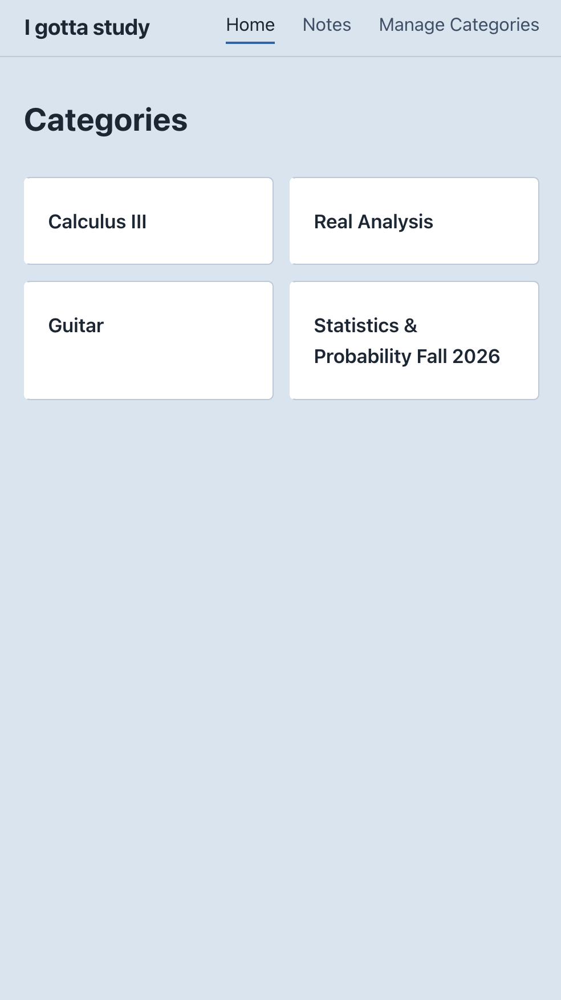
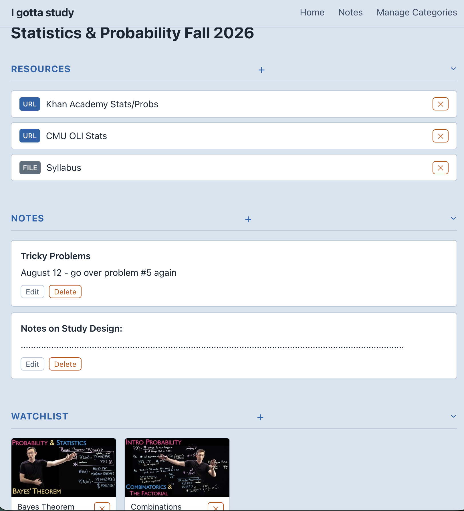

# I Gotta Study

**Watch YouTube lectures in a distraction-free, colorblind-friendly UI and track online resources.**


A personal learning organizer for YouTube videos, reference links, and notes. Group everything into categories (e.g. *Calculus III*, *Side Project*, *Guitar*) and watch videos in a distraction-free player — no sidebar, no recommendations, no rabbit holes.

<table>
<tr>
<td></td>
<td></td>
</tr>
</table>

## Tech Stack

| Layer | Technology |
|---|---|
| Backend | Python 3, Flask 3, SQLAlchemy, SQLite |
| Frontend | React 19, Vite 8, React Router v7, plain CSS |
| Tests | pytest |
| YouTube | YouTube Data API v3 (playlist import) |

## Getting Started

### With Docker

```bash
cp .env.example .env                          # set SECRET_KEY and YOUTUBE_API_KEY
docker compose up --build
docker compose exec backend flask init-db     # first run only — creates DB tables
# App is at http://localhost
```

**One-click desktop launcher (macOS):** After the initial `.env` setup above, symlink the launcher to your Desktop:
```bash
ln -s "$PWD/scripts/launch.command" "$HOME/Desktop/I Gotta Study.command"
```
Double-click the file on your Desktop to start Docker Desktop (if needed), bring up the stack, and open the app in your browser.

### Local dev (no Docker)

```bash
git clone <repo-url> && cd I-gotta-study
python -m venv .venv && source .venv/bin/activate
pip install -r backend/requirements.txt
cp .env.example .env           # set YOUTUBE_API_KEY if you want playlist import
```

**Backend:**
```bash
cd backend
flask init-db
python run.py                  # http://localhost:5000  (or: flask run --debug)
```

**Frontend** (separate terminal):
```bash
cd frontend && npm install && npm run dev   # http://localhost:5173
```

**Tests:**
```bash
cd backend && pytest tests/ -v
```

## Technical Notes

**frontend-design plugin for colorblind-friendly UI**: I used Claude plugin `/frontend-design` to write the CSS and make the UI colorblind-friendly.

**App factory with test config** — `create_app(test_config)` accepts an optional config dict, which lets the test suite swap in an in-memory SQLite database without touching `.env` or patching globals. Each test gets a fresh, isolated database via a pytest fixture.

**CORS** — `CORS(app)` is applied unconditionally with permissive defaults (all origins allowed). In development this is invisible: Vite proxies `/api/*` to `http://localhost:5000`, so the browser never makes a cross-origin request and no CORS headers are exercised. In production the permissive config is intentional — this is a single-user personal tool with no auth surface to protect.

**React Compiler** — the project opts into the experimental React Compiler (`babel-plugin-react-compiler`) via Rolldown's Babel plugin. The compiler automatically memoizes components and hooks, removing the need for manual `useMemo`/`useCallback` calls.

**Distraction-free video player** — videos are embedded via `youtube-nocookie.com`.

## Project Structure

```
I-gotta-study/
├── docker-compose.yml
├── backend/
│   ├── Dockerfile
│   ├── api/
│   │   ├── __init__.py       # app factory + db instance
│   │   ├── models/           # Category, Video, Resource, Note
│   │   ├── routes/           # categories, videos, resources, notes
│   │   └── utils/youtube.py  # video ID extraction + playlist import
│   ├── tests/
│   ├── config.py
│   └── run.py
└── frontend/
    ├── Dockerfile
    ├── nginx.conf
    └── src/
        ├── api.js            # all fetch() wrappers
        ├── components/
        └── pages/
            ├── HomePage.jsx/css
            ├── CategoryPage.jsx/css
            ├── WatchPage.jsx/css
            ├── ManageCategoriesPage.jsx/css
            └── NotesPage.jsx/css
```
